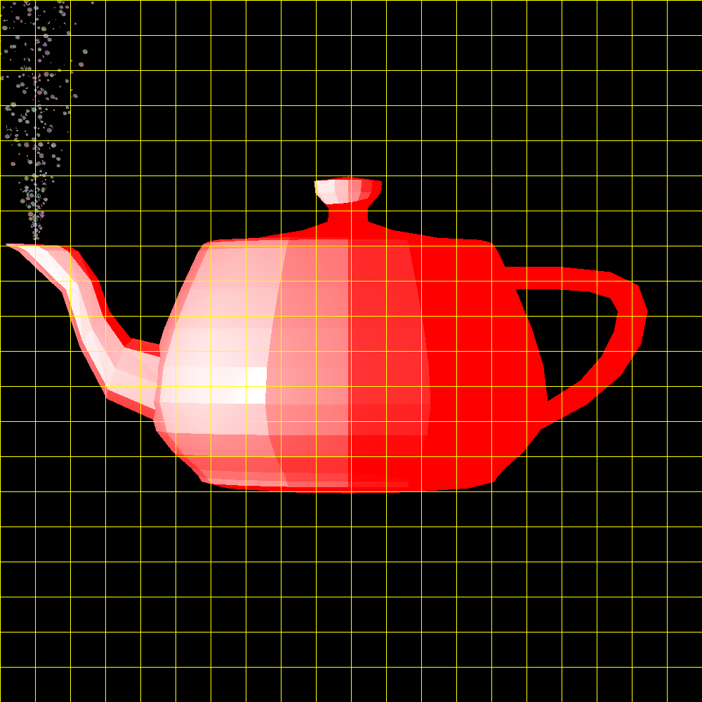

# Mini Project – Java 3D Renderer -Eitan-x

A straightforward ray-tracing based 3D renderer written in Java as part of my cs degree projects.

## Key Features
- Basic ray-tracing and scene setup
- Essential vector math for camera and geometry
- Unit tests to verify functionality
- Adaptive supersampling for improved anti‑aliasing
- Multithreading
- Phong shading for realistic lighting and shadows
  - Ambient, diffuse, and specular components  
  

## Requirements

To run this project, make sure you have the following installed:

- **Java:** 1.8 (Java SE 8) or higher
- **JUnit:** 5.9.2 (for unit testing)
- **IDE:** IntelliJ IDEA (or any Java-supporting IDE)
- **Optional:** Git (for cloning the repository)

Ensure that your IDE is configured to use the correct JDK (1.8) and that JUnit 5.9.2 is included in your project dependencies.

## Getting Started
1. Clone the repo:
    ```bash
   git clone https://github.com/eitan-x/ISE5785_5745.git
Open it in your IDE (e.g., IntelliJ).
Run the tests, use your IDE’s test runner or an appropriate build tool.
To see example renders or to create your own test scenes, run the tests using your IDE’s test runner or an appropriate build tool.
Each test is set up with a specific scene and rendering parameters.
By looking at the tests, you can understand how to configure new scenes and generate the images you want.
The resulting images will be saved in the images/ directory.


## Examples 



